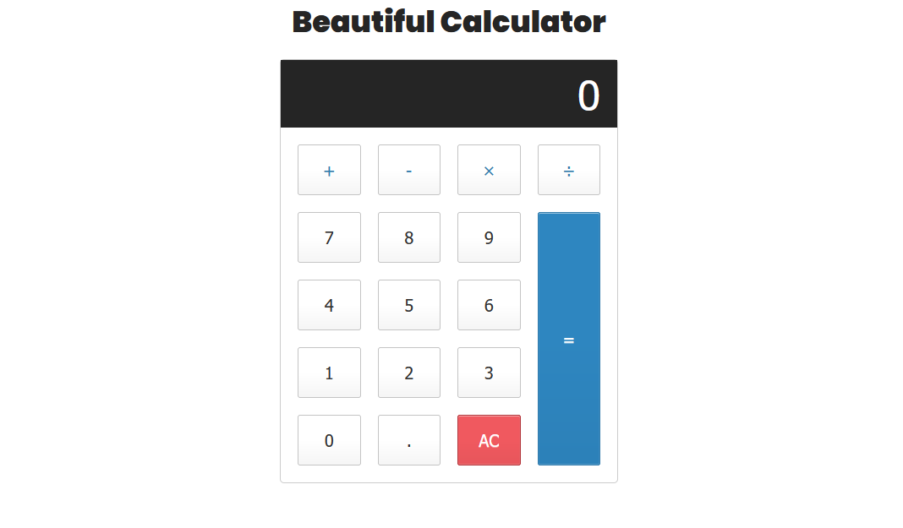

 

## 🚀 Tecnologias

Esse projeto foi desenvolvido com as seguintes tecnologias:

- HTML
- CSS
- JavaScript

## 💻 Projeto

Projeto de uma calculadora simples realizado no programa de estágio que estou participando, com foco no aprendizado e estudo do JavaScript.

## 🔖 Layout

Você pode visualizar o layout do projeto através [desse link](https://beautiful-calculator.vercel.app/).
